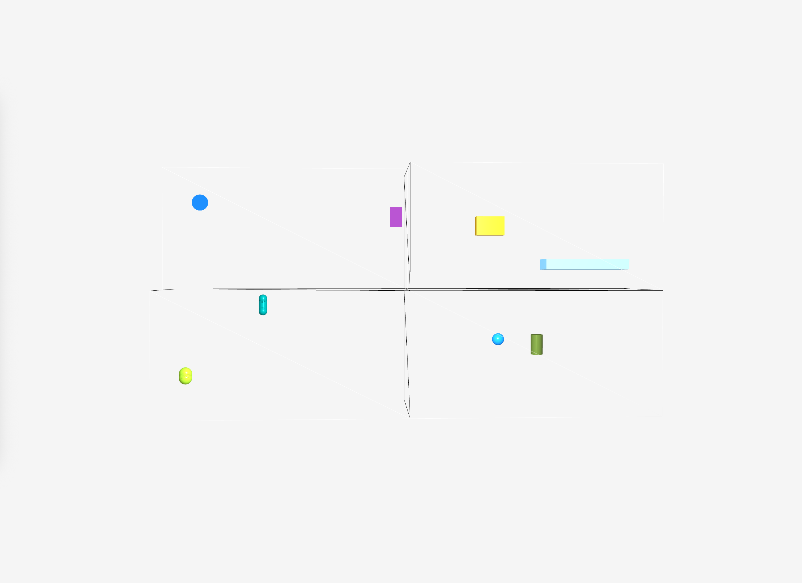
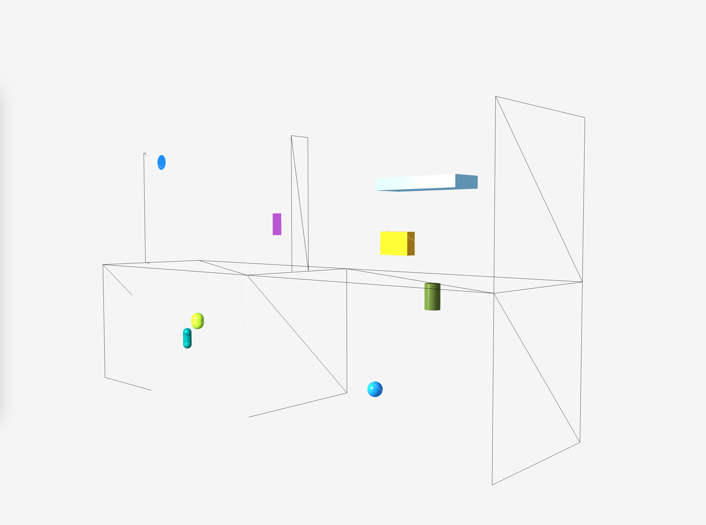
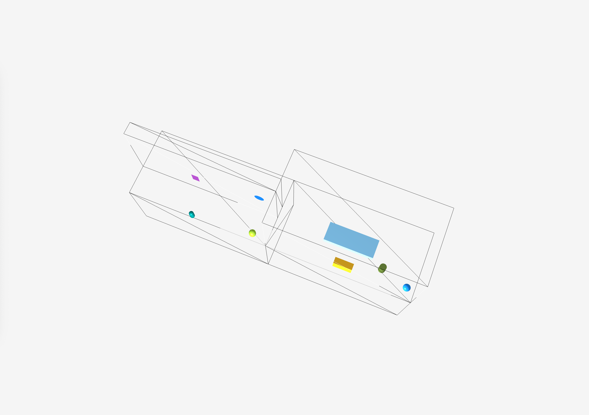
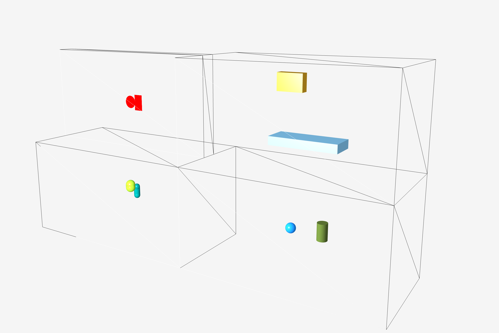
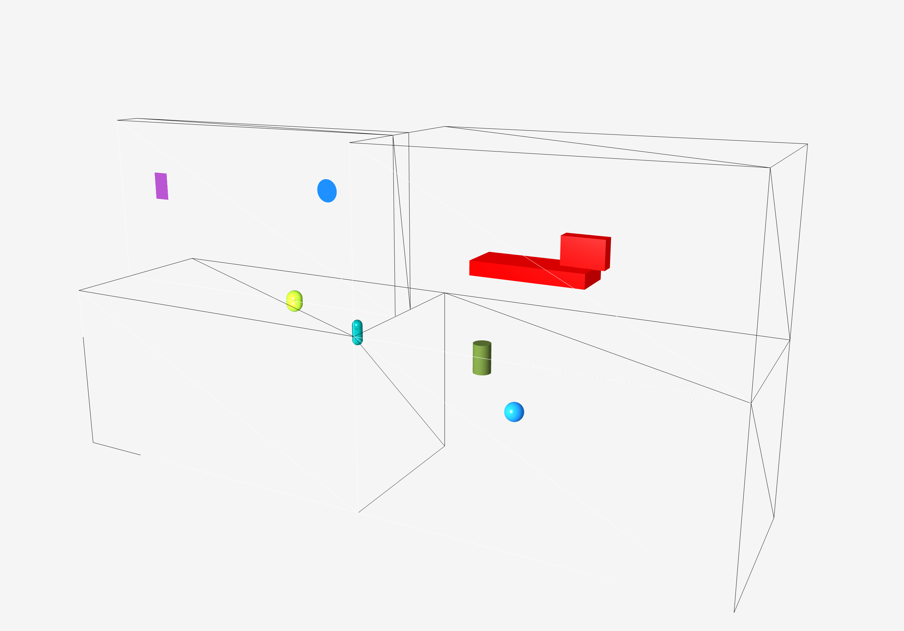
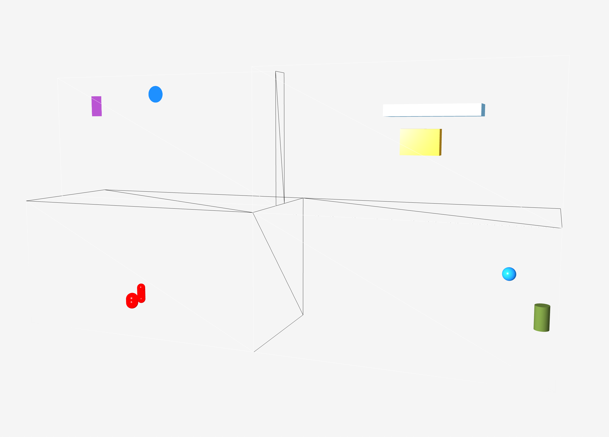

# VR Dersleri: Çarpışma Algılama ve Fizik Simülasyonu Projesi

## Özet

Bu proje, sanal gerçeklik (VR) ve oyun motoru geliştirme süreçlerinin temel taşlarından biri olan **Çarpışma Algılama (Collision Detection)** prensiplerinin JavaFX kullanılarak 3 boyutlu bir ortamda simüle edilmesini amaçlamaktadır. Proje kapsamında, farklı geometrik şekillerin (küre, silindir, dikdörtgen prizma, kapsül, daire, dikdörtgen) matematiksel modelleri oluşturulmuş ve bu şekillerin birbirleriyle olan etkileşimleri analitik geometri prensipleri çerçevesinde gerçek zamanlı olarak incelenmiştir.




*Şekil (1-3): Farklı açılardan Collision Studio uygulamasının genel görünümü. 3 boyutlu uzayda dört farklı bölgede eş zamanlı olarak çalışan çarpışma simülasyonları. Kullanıcı fare ile kamerayı döndürebilir ve scroll ile yakınlaştırıp uzaklaştırabilir.*

---

## 1. Giriş ve Amaç

Çarpışma algılama, bilgisayar grafikleri, oyun geliştirme, robotik, fizik simülasyonları ve sanal gerçeklik uygulamalarında kritik bir rol oynar. Bu çalışmada, temel geometrik şekiller arasındaki çarpışma durumlarının matematiksel olarak nasıl tespit edilebileceği ve bu tespitlerin gerçek zamanlı bir simülasyon ortamında nasıl görselleştirilebileceği gösterilmiştir.

Projenin temel hedefleri:
- Farklı geometrik şekiller için çarpışma algılama algoritmalarının implementasyonu
- Bu algoritmaların 3D görselleştirme ortamında test edilmesi
- Çarpışma anında görsel geri bildirim mekanizmasının oluşturulması
- Kullanıcı etkileşimli bir simülasyon ortamının geliştirilmesi

---

## 2. Proje Mimarisi ve Yazılım Yapısı

Uygulama, **JavaFX 21** kütüphanesi üzerine inşa edilmiş olup, Nesne Yönelimli Programlama (OOP) prensiplerine sıkı sıkıya bağlı kalınarak geliştirilmiştir. Proje, modüler bir yapıya sahiptir ve her bir geometrik şekil için ayrı collider ve shape sınıfları içermektedir.

### 2.1. Temel Bileşenler

#### 2.1.1. CollisionApplication.java
Uygulamanın ana giriş noktasıdır. Aşağıdaki görevleri yerine getirir:
- **3D Sahne Kurulumu**: 2400x1200 piksel boyutunda bir sahne oluşturulur
- **Kamera Yapılandırması**: PerspectiveCamera ile 3D görünüm sağlanır (Field of View: 40°, Near Clip: 0.1, Far Clip: 10000)
- **Işıklandırma**: AmbientLight ve PointLight ile sahne aydınlatılır
- **Bölge Ayrımı**: Sahne dört eşit bölgeye ayrılarak her birinde farklı çarpışma senaryoları simüle edilir
- **Animasyon Döngüsü**: AnimationTimer ile her frame'de şekiller güncellenir ve çarpışma kontrolleri yapılır
- **Kullanıcı Etkileşimi**: Mouse drag ile kamera rotasyonu, scroll ile zoom işlevleri


*Şekil 4: Uygulama arayüzünün detaylı görünümü. Sol üstte daire-dikdörtgen, sağ üstte prizma-prizma, sol altta kapsül-kapsül, sağ altta küre-silindir çarpışma simülasyonları görülmektedir.*

#### 2.1.2. CollisionManager.java
Çarpışma mantığının merkezi işlem birimidir. Pattern matching (switch-case) kullanılarak farklı çarpışma testleri yönetilir. Her çarpışma tipi için özelleştirilmiş statik metodlar içerir:
- `isColliding(CircleCollider, RectangleCollider)`
- `isColliding(SphereCollider, CylinderCollider)`
- `isColliding(SurfaceCollider, RectangularPrismCollider)`
- `isColliding(RectangularPrismCollider, RectangularPrismCollider)`
- `isColliding(CapsuleCollider, CapsuleCollider)`

#### 2.1.3. GeometricCollider (Soyut Sınıf)
Tüm çarpışma şekillerinin türediği temel sınıftır. 3D uzaydaki konum bilgisini (x, y, z) tutar ve alt sınıflara kalıtım yoluyla aktarır.

#### 2.1.4. GeometricShape (Soyut Sınıf)
Görselleştirme ve fiziksel güncelleme döngülerini yönetir. Her şekil için:
- Konum (x, y, z) ve hız (vx, vy, vz) bilgileri
- JavaFX Node referansı (görsel temsil)
- Collider referansı (çarpışma hesaplamaları için)
- `update()` metodu ile sınır kontrolleri ve hareket
- `onCollision()` metodu ile görsel geri bildirim (kırmızı renk)

### 2.2. Şekil Hiyerarşisi

Projede aşağıdaki şekiller implemente edilmiştir:

**2D Şekiller:**
- `CircleShape` / `CircleCollider`: Yarıçap parametresi ile tanımlı daire
- `RectangleShape` / `RectangleCollider`: Genişlik ve yükseklik parametreleri ile tanımlı dikdörtgen

**3D Şekiller:**
- `SphereShape` / `SphereCollider`: Yarıçap parametresi ile tanımlı küre
- `CylinderShape` / `CylinderCollider`: Yarıçap ve yükseklik parametreleri ile tanımlı silindir
- `RectangularPrismShape` / `RectangularPrismCollider`: Genişlik, yükseklik ve derinlik parametreleri ile tanımlı dikdörtgen prizma
- `CapsuleShape` / `CapsuleCollider`: Yarıçap ve yükseklik parametreleri ile tanımlı kapsül (silindirik gövde + iki yarım küre)
- `SurfaceCollider`: Normal vektör ve derinlik parametreleri ile tanımlı düzlem yüzey

---

## 3. Çarpışma Prensipleri ve Algoritmalar

Projede kullanılan çarpışma algoritmaları, şekillerin geometrik özelliklerine göre özelleştirilmiştir. Her algoritma, matematiksel olarak kanıtlanmış geometri prensiplerine dayanmaktadır. Aşağıda, projede implemente edilen temel çarpışma durumları ve detaylı matematiksel açıklamaları verilmiştir.

### 3.1. Daire ve Dikdörtgen Çarpışması (Circle - Rectangle)

Bu senaryoda, bir dairenin bir dikdörtgen ile teması kontrol edilir. Bu, 2D oyunlarda ve UI etkileşimlerinde sıkça kullanılan bir çarpışma tipidir.


*Şekil 5: Daire ve dikdörtgen arasındaki çarpışma tespiti. Çarpışma anında her iki şekil de kırmızı renge dönüşmektedir. Dairenin merkezinden dikdörtgenin en yakın noktasına olan uzaklık, dairenin yarıçapından küçükse çarpışma gerçekleşir.*

**Matematiksel Prensip:**

Çarpışma testi, dairenin merkezine en yakın dikdörtgen üzerindeki noktanın bulunması prensibine dayanır. Bu yaklaşım, "closest point on AABB (Axis-Aligned Bounding Box)" algoritması olarak bilinir.

**Algoritma Adımları:**

1. **En Yakın Nokta Hesaplama**: Dairenin merkez koordinatları (Cₓ, Cᵧ) alınır ve bu koordinatlar, dikdörtgenin sınırları (Rₓₘᵢₙ, Rₓₘₐₓ, Rᵧₘᵢₙ, Rᵧₘₐₓ) arasına "clamp" (kısıtlama) işlemine tabi tutulur:

   $$P_x = \max(R_{x_{min}}, \min(C_x, R_{x_{max}}))$$
   
   $$P_y = \max(R_{y_{min}}, \min(C_y, R_{y_{max}}))$$

   Bu işlem sonucunda dikdörtgen üzerinde (veya içinde) daireye en yakın nokta (Pₓ, Pᵧ) elde edilir.

2. **Uzaklık Hesaplama**: Dairenin merkezi ile bu en yakın nokta arasındaki Öklid uzaklığının karesi hesaplanır:

   $$d^2 = (C_x - P_x)^2 + (C_y - P_y)^2$$

3. **Çarpışma Kontrolü**: Eğer bu uzaklığın karesi, dairenin yarıçapının karesinden küçük veya eşitse çarpışma gerçekleşmiş demektir:

   $$d^2 \leq r^2$$

   **Not**: Kare alma işlemi, karekök işleminin maliyetinden kaçınmak için performans optimizasyonu olarak kullanılmıştır. Karekök fonksiyonu, kare alma işleminden çok daha maliyetlidir.

**Kod İmplementasyonu:**
```java
double closestX = Math.clamp(circle.getX(), rectangle.getX(), 
                             rectangle.getX() + rectangle.getWidth());
double closestY = Math.clamp(circle.getY(), rectangle.getY(), 
                             rectangle.getY() + rectangle.getHeight());
double distanceSquared = (circle.getX() - closestX) * (circle.getX() - closestX) 
                       + (circle.getY() - closestY) * (circle.getY() - closestY);
double radiusSquared = circle.getRadius() * circle.getRadius();
return distanceSquared < radiusSquared;
```

---

### 3.2. Küre ve Silindir Çarpışması (Sphere - Cylinder)

3 boyutlu uzayda bir küre ile silindirin etkileşimi incelenmiştir. Bu çarpışma tipi, özellikle karakter hareketlerinde ve nesne etkileşimlerinde kullanılır.


*Şekil 6: Küre ve silindir arasındaki çarpışma tespiti. Küre, silindirin yatay düzlemindeki (XZ) çemberi ile ve dikey (Y) sınırları ile kontrol edilir. Çarpışma anında her iki şekil de kırmızı renge dönüşmektedir.*

**Algoritma:**

Bu kontrol iki aşamada gerçekleştirilir:

1. **Yatay Uzaklık Kontrolü**: Küre merkezi ile silindir merkezi arasındaki yatay (XZ düzlemindeki) uzaklık hesaplanır. Bu uzaklık, silindir yarıçapı ile küre yarıçapının toplamından büyükse çarpışma imkansızdır:

   $$d_{horizontal}^2 = (S_x - C_x)^2 + (S_z - C_z)^2$$
   
   $$d_{horizontal}^2 > (r_{cylinder} + r_{sphere})^2 \Rightarrow \text{Çarpışma Yok}$$

2. **Dikey Aralık Kontrolü**: Eğer yatay çarpışma şartı sağlanıyorsa, dikey (Y ekseni) sınırlara bakılır. Kürenin en alt ve en üst noktalarının, silindirin yükseklik aralığı içinde kalıp kalmadığı kontrol edilir:

   $$C_{y_{base}} = C_y - \frac{h_{cylinder}}{2}$$
   
   $$C_{y_{top}} = C_y + \frac{h_{cylinder}}{2}$$
   
   $$(S_y + r_{sphere} \geq C_{y_{base}}) \land (S_y - r_{sphere} \leq C_{y_{top}}) \Rightarrow \text{Çarpışma Var}$$

**Kod İmplementasyonu:**
```java
double distanceX = sphere.getX() - cylinder.getX();
double distanceZ = sphere.getZ() - cylinder.getZ();
double horizontalDistanceSquared = (distanceX * distanceX) + (distanceZ * distanceZ);
double totalRadius = cylinder.getRadius() + sphere.getRadius();

if (horizontalDistanceSquared > (totalRadius * totalRadius)) {
    return false; // Yatayda çarpışma yok
}

double halfHeight = cylinder.getHeight() / 2.0;
double cylinderBaseLimit = cylinder.getY() - halfHeight;
double cylinderTopLimit = cylinder.getY() + halfHeight;

return (sphere.getY() + sphere.getRadius() >= cylinderBaseLimit)
    && (sphere.getY() - sphere.getRadius() <= cylinderTopLimit);
```

---

### 3.3. Yüzey ve Dikdörtgen Prizma Çarpışması (Surface - Rectangular Prism)

Büyük bir yüzey (zemin veya duvar) ile bir prizmanın çarpışmasıdır. Bu tip çarpışmalar, karakterlerin zemin üzerinde yürümesi veya nesnelerin duvarlara çarpması gibi senaryolarda kullanılır.

**Matematiksel Yaklaşım:**

Bu algoritma, "Separating Axis Theorem (SAT)" prensibinin basitleştirilmiş bir versiyonudur. Prizmanın merkezinden yüzeye olan uzaklık hesaplanır. Ayrıca, prizmanın boyutlarının (yarım genişlik, yarım yükseklik, yarım derinlik) yüzey normali üzerine iz düşümleri alınarak bir "etki yarıçapı" (projection) belirlenir.

**Algoritma:**

1. **Prizma Projeksiyonu**: Prizmanın yarı boyutları (halfWidth, halfHeight, halfDepth) yüzey normali (Nₓ, Nᵧ, Nᵧ) üzerine izdüşürülür:

   $$Projection = \left(\frac{w}{2} \cdot |N_x|\right) + \left(\frac{h}{2} \cdot |N_y|\right) + \left(\frac{d}{2} \cdot |N_z|\right)$$

   Bu değer, prizmanın yüzey normali boyunca kapladığı maksimum mesafeyi temsil eder.

2. **Uzaklık Hesaplama**: Prizma merkezinin (Pₓ, Pᵧ, Pᵧ) yüzeye olan uzaklığı, düzlem denklemi kullanılarak hesaplanır:

   $$Distance = (N_x \cdot P_x) + (N_y \cdot P_y) + (N_z \cdot P_z) + D$$

   Burada D, yüzeyin derinlik (offset) parametresidir.

3. **Çarpışma Kontrolü**: Eğer mutlak uzaklık değeri, projeksiyon değerinden küçükse, prizma yüzeye nüfuz etmiş demektir:

   $$|Distance| < Projection \Rightarrow \text{Çarpışma Var}$$

**Kod İmplementasyonu:**
```java
double halfWidth = prism.getWidth() / 2.0;
double halfHeight = prism.getHeight() / 2.0;
double halfDepth = prism.getDepth() / 2.0;

double prismProjection = (halfWidth * Math.abs(surface.getX()))
                      + (halfHeight * Math.abs(surface.getY()))
                      + (halfDepth * Math.abs(surface.getZ()));

double distancePrismCentreToSurface = (surface.getX() * prism.getX())
                                    + (surface.getY() * prism.getY())
                                    + (surface.getZ() * prism.getZ())
                                    + surface.getDepth();

return Math.abs(distancePrismCentreToSurface) < prismProjection;
```

---

### 3.4. Dikdörtgen Prizma ve Dikdörtgen Prizma Çarpışması (Rectangular Prism - Rectangular Prism)

İki dikdörtgen prizmanın çarpışması, "Axis-Aligned Bounding Box (AABB)" çarpışma testi olarak bilinir. Bu, 3D oyunlarda en yaygın kullanılan çarpışma tipidir.


*Şekil 7: İki dikdörtgen prizma arasındaki çarpışma tespiti. Her eksen (X, Y, Z) üzerinde örtüşme kontrolü yapılır. Tüm eksenlerde örtüşme varsa çarpışma gerçekleşir.*

**Algoritma:**

Separating Axis Theorem (SAT) prensibine göre, iki AABB'nin çarpışması için her üç eksende (X, Y, Z) örtüşme olması gerekir. Eğer herhangi bir eksende örtüşme yoksa, çarpışma yoktur.

**Her Eksen İçin Kontrol:**

$$|P1_x - P2_x| < \frac{w_1 + w_2}{2} \Rightarrow \text{X ekseninde örtüşme}$$

$$|P1_y - P2_y| < \frac{h_1 + h_2}{2} \Rightarrow \text{Y ekseninde örtüşme}$$

$$|P1_z - P2_z| < \frac{d_1 + d_2}{2} \Rightarrow \text{Z ekseninde örtüşme}$$

**Çarpışma Koşulu:**

$$\text{Çarpışma} \Leftrightarrow \text{X örtüşme} \land \text{Y örtüşme} \land \text{Z örtüşme}$$

**Kod İmplementasyonu:**
```java
boolean xOverlap = Math.abs(prismFirst.getX() - prismSecond.getX()) 
                < (prismFirst.getWidth() + prismSecond.getWidth()) / 2.0;
boolean yOverlap = Math.abs(prismFirst.getY() - prismSecond.getY()) 
                < (prismFirst.getHeight() + prismSecond.getHeight()) / 2.0;
boolean zOverlap = Math.abs(prismFirst.getZ() - prismSecond.getZ()) 
                < (prismFirst.getDepth() + prismSecond.getDepth()) / 2.0;
return xOverlap && yOverlap && zOverlap;
```

---

### 3.5. Kapsül ve Kapsül Çarpışması (Capsule - Capsule)

İki kapsülün çarpışması, hem silindirik gövdelerinin hem de uçlarındaki yarım kürelerin dikkate alınmasını gerektirir. Kapsüller, karakter animasyonlarında ve karakteristik şekilli nesnelerde sıkça kullanılır.


*Şekil 8: İki kapsül arasındaki çarpışma tespiti. Yatay düzlemde (XZ) silindirik gövdelerin çarpışması, dikey eksende (Y) yükseklik aralıklarının örtüşmesi kontrol edilir.*

**Yöntem:**

Basitleştirilmiş bir model olarak, kapsüller dikey olarak hizalandığında:

1. **Yatay Uzaklık Kontrolü**: İki kapsülün merkez eksenleri arasındaki yatay uzaklık (XZ düzlemi) kontrol edilir:

   $$d_{horizontal}^2 = (C1_x - C2_x)^2 + (C1_z - C2_z)^2$$
   
   $$d_{horizontal}^2 > (r_1 + r_2)^2 \Rightarrow \text{Çarpışma Yok}$$

2. **Dikey Aralık Kontrolü**: Dikeyde (Y ekseni) ise, iki kapsülün yüksekliklerinin ortalaması bir eşik değer olarak kullanılır:

   $$d_y = |C1_y - C2_y|$$
   
   $$h_{threshold} = \frac{h_1 + h_2}{2}$$
   
   $$d_y < h_{threshold} \Rightarrow \text{Çarpışma Var}$$

**Kod İmplementasyonu:**
```java
double dx = capsuleFirst.getX() - capsuleSecond.getX();
double dz = capsuleFirst.getZ() - capsuleSecond.getZ();
double distanceSquared = (dx * dx) + (dz * dz);
double radiusSum = capsuleFirst.getRadius() + capsuleSecond.getRadius();

if (distanceSquared > (radiusSum * radiusSum)) {
    return false; // Yatayda çarpışma yok
}

double dy = Math.abs(capsuleFirst.getY() - capsuleSecond.getY());
double heightSumHalved = (capsuleFirst.getHeight() + capsuleSecond.getHeight()) / 2.0;
return dy < heightSumHalved;
```

---

## 4. Görsel Geri Bildirim ve Kullanıcı Etkileşimi

### 4.1. Çarpışma Görselleştirmesi

Çarpışma algılandığında, ilgili şekillerin renkleri otomatik olarak kırmızıya dönüşür. Bu, kullanıcının çarpışmaları anında gözlemlemesini sağlar. Çarpışma sona erdiğinde, şekiller orijinal renklerine geri döner.


*Şekil 9: Çarpışma anında şekillerin kırmızı renge dönüşmesi. Bu görsel geri bildirim, algoritmaların doğru çalıştığını doğrulamak için kritik öneme sahiptir.*

### 4.2. Kamera Kontrolü

Kullanıcı, fare ile sahneyi farklı açılardan inceleyebilir:
- **Mouse Drag**: Kamerayı X ve Y eksenleri etrafında döndürür
- **Mouse Scroll**: Kamerayı ileri-geri hareket ettirerek zoom yapar


*Şekil 10: Kullanıcı fare ile kamerayı döndürerek sahneyi farklı açılardan inceleyebilir. Scroll ile yakınlaştırma ve uzaklaştırma yapılabilir.*

### 4.3. Loglama Sistemi

Her çarpışma kontrolü sırasında, detaylı matematiksel hesaplamalar Java Logger kullanılarak konsola yazdırılır. Bu loglar, algoritmaların doğruluğunu test etmek ve debug yapmak için kullanılabilir.

**Örnek Log Çıktısı:**
```
INFO: Closest point: (550.0, 600.0)
INFO: Distance between the centre of the circle and the nearest point: (50.0, 0.0)
INFO: (Pythagorean Theorem) Distance squared: 2500.0, Radius squared: 1600.0
INFO: Collision: CircleShape vs RectangleShape. Total: 1
```

---

## 5. Teknik Detaylar ve Performans

### 5.1. Kullanılan Teknolojiler

- **Programlama Dili**: Java (JDK 21+)
- **Görselleştirme Kütüphanesi**: JavaFX 21 (3D API)
- **Oyun Motoru Kütüphanesi**: FXGL 17.3 (kısmi kullanım)
- **Build Aracı**: Maven
- **Test Framework**: JUnit 5.10.2
- **Loglama**: `java.util.logging`

### 5.2. Performans Optimizasyonları

1. **Karekök Yerine Kare Kullanımı**: Uzaklık karşılaştırmalarında karekök hesaplaması yerine kare değerleri karşılaştırılarak performans artırılmıştır.

2. **Erken Çıkış (Early Exit)**: Bazı algoritmalarda (örneğin küre-silindir, kapsül-kapsül), yatay uzaklık kontrolü başarısız olursa dikey kontrol yapılmadan false döndürülür.

3. **Statik Metodlar**: CollisionManager sınıfındaki tüm metodlar statiktir, böylece nesne oluşturma maliyeti ortadan kaldırılmıştır.

4. **Pattern Matching**: Java 21'in pattern matching özelliği kullanılarak, çarpışma tipi belirleme işlemi optimize edilmiştir.

### 5.3. Mimari Tasarım Prensipleri

- **Separation of Concerns**: Görselleştirme (Shape) ve çarpışma hesaplamaları (Collider) ayrı sınıflarda tutulmuştur.
- **Single Responsibility Principle**: Her sınıf tek bir sorumluluğa sahiptir.
- **Open/Closed Principle**: Yeni şekil tipleri eklemek için mevcut kodu değiştirmek gerekmez, sadece yeni sınıflar eklenir.
- **Dependency Inversion**: GeometricShape, GeometricCollider arayüzüne bağımlıdır, somut implementasyonlara değil.

---

## 6. Simülasyon Senaryoları

Uygulama, dört farklı bölgede eş zamanlı olarak çalışan çarpışma simülasyonları içerir:

### Senaryo 1: Sol Üst Bölge - Daire ve Dikdörtgen
- **Şekiller**: Mavi daire (yarıçap: 40) ve Mor dikdörtgen (60x100)
- **Hareket**: Her iki şekil de sınırlar içinde rastgele hareket eder
- **Çarpışma Tipi**: 2D düzlemde en yakın nokta algoritması

### Senaryo 2: Sağ Üst Bölge - İki Dikdörtgen Prizma
- **Şekiller**: Altın sarısı küçük prizma (150x100x50) ve Açık mavi büyük prizma (400x50x150)
- **Hareket**: Farklı hızlarda hareket ederler
- **Çarpışma Tipi**: AABB (Axis-Aligned Bounding Box) çarpışma testi

### Senaryo 3: Sol Alt Bölge - İki Kapsül
- **Şekiller**: Teal renkli kapsül (yarıçap: 20, yükseklik: 100) ve Sarı-yeşil kapsül (yarıçap: 30, yükseklik: 80)
- **Hareket**: Farklı yönlerde ve hızlarda hareket ederler
- **Çarpışma Tipi**: Yatay ve dikey aralık kontrolü

### Senaryo 4: Sağ Alt Bölge - Küre ve Silindir
- **Şekiller**: Mavi küre (yarıçap: 30) ve Koyu zeytin yeşili silindir (yarıçap: 30, yükseklik: 100)
- **Hareket**: 3D uzayda hareket ederler
- **Çarpışma Tipi**: Yatay uzaklık + dikey aralık kontrolü


*Şekil 11-14: Dört farklı çarpışma senaryosunun çarpışma anı görüntüleri. Her bölge, farklı bir çarpışma algoritmasını test etmektedir.*

---

## 7. Sonuç ve Değerlendirme

Bu çalışma ile, teorik fizik ve geometri formüllerinin gerçek zamanlı bir yazılım simülasyonuna nasıl dönüştürülebileceği başarılı bir şekilde gösterilmiştir. Oluşturulan "Collision Studio" ortamı, dört farklı fiziksel etkileşimi aynı anda render ederek, algoritmaların doğruluk performansını görsel olarak teyit etme imkanı sunmaktadır.

### 7.1. Başarılar

- ✅ Beş farklı çarpışma algoritmasının başarılı implementasyonu
- ✅ Gerçek zamanlı görselleştirme ve geri bildirim mekanizması
- ✅ Modüler ve genişletilebilir kod mimarisi
- ✅ Kullanıcı etkileşimli 3D simülasyon ortamı
- ✅ Detaylı loglama ve debug imkanları

### 7.2. Gelecek Geliştirmeler

- **Çarpışma Çözümü (Collision Response)**: Şu anda çarpışma anında sadece hız tersine çevrilmektedir. Daha gerçekçi fizik simülasyonu için momentum korunumu ve enerji kaybı hesaplamaları eklenebilir.
- **Rotasyon Desteği**: Şu anda tüm şekiller axis-aligned (eksen hizalı) durumdadır. Rotasyon desteği eklenerek daha karmaşık çarpışma senaryoları test edilebilir.
- **Spatial Partitioning**: Çok sayıda nesne için performans optimizasyonu amacıyla Octree veya BSP Tree gibi uzaysal bölümleme algoritmaları eklenebilir.
- **GJK/EPA Algoritması**: Daha karmaşık şekiller için GJK (Gilbert-Johnson-Keerthi) ve EPA (Expanding Polytope Algorithm) algoritmaları implemente edilebilir.

---

## 8. Kullanım Kılavuzu

### 8.1. Projeyi Çalıştırma

1. **Gereksinimler**: JDK 21 veya üzeri, Maven 3.6+
2. **Derleme**: `mvn clean compile`
3. **Çalıştırma**: `mvn javafx:run`
4. **Alternatif**: IDE'den `CollisionApplication` sınıfını çalıştırın

### 8.2. Kontroller

- **Mouse Drag**: Kamerayı döndür
- **Mouse Scroll**: Zoom in/out
- **Konsol**: Çarpışma loglarını görüntüle

### 8.3. Kod Yapısı

```
src/main/java/com/fati/collision/
├── CollisionApplication.java      # Ana uygulama
├── collider/                      # Çarpışma algılama sınıfları
│   ├── GeometricCollider.java
│   ├── CollisionManager.java
│   ├── CircleCollider.java
│   ├── RectangleCollider.java
│   ├── SphereCollider.java
│   ├── CylinderCollider.java
│   ├── RectangularPrismCollider.java
│   ├── CapsuleCollider.java
│   └── SurfaceCollider.java
└── shapes/                        # Görselleştirme sınıfları
    ├── GeometricShape.java
    ├── CircleShape.java
    ├── RectangleShape.java
    ├── SphereShape.java
    ├── CylinderShape.java
    ├── RectangularPrismShape.java
    └── CapsuleShape.java
```
---

**Hazırlayan**: Fatih CELIK  
**Tarih**: 2025  
**Versiyon**: 1.0

